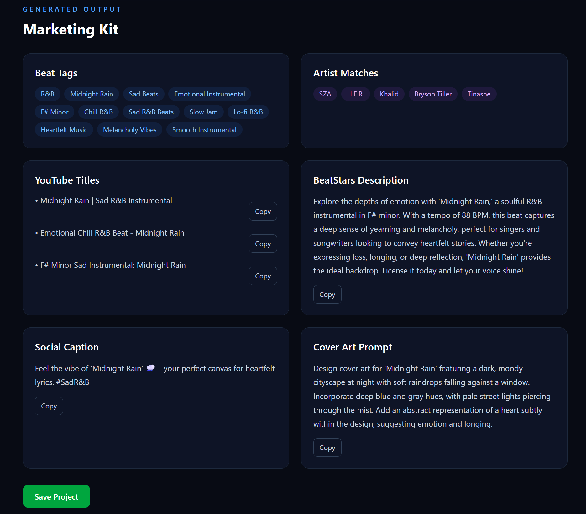
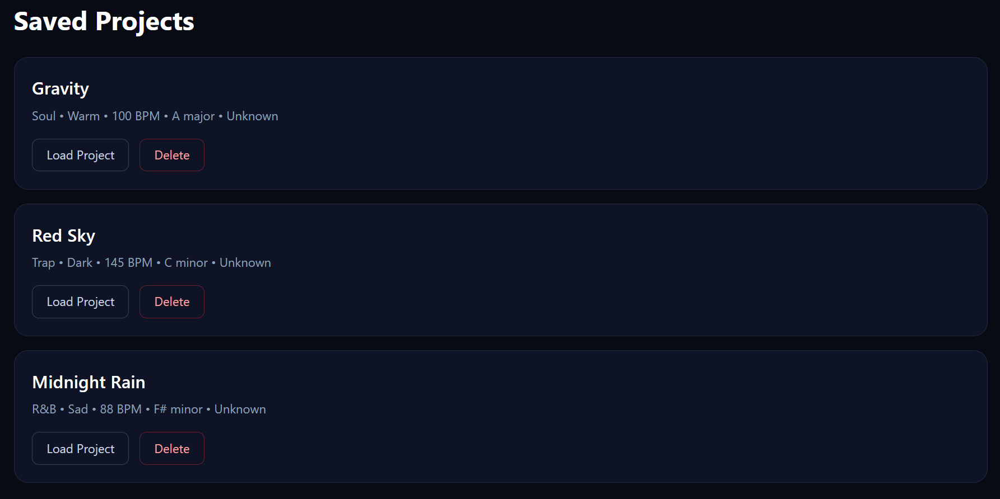
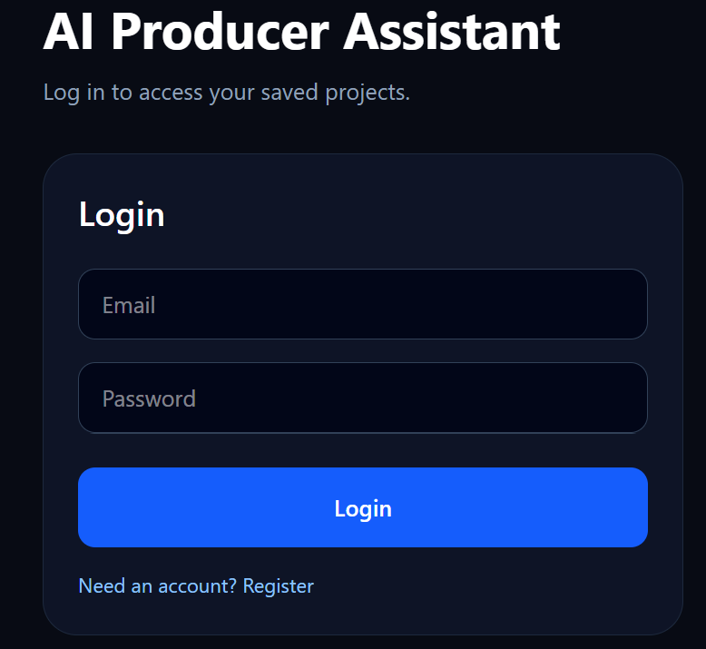

# AI Producer Assistant

Music producers spend a surprising amount of time coming up with titles, tags, descriptions, artist matches, and other marketing assets before they can publish a beat. AI Producer Assistant streamlines that workflow by generating a complete marketing kit from a beat's metadata, allowing producers to spend more time creating music and less time preparing uploads.

Users can create an account, log in, enter beat information, generate a complete marketing kit, save projects, and revisit saved projects later.

## Live Demo

Frontend: https://ai-producer-assistant.vercel.app  
Backend API: https://ai-producer-assistant.onrender.com

# Screenshots

## Dashboard


## AI Marketing Kit



## Saved Projects



## Login




## Features

- User registration and login
- JWT authentication
- AI-generated marketing kits
- Beat title, genre, mood, BPM, and key input
- Generated beat tags, YouTube titles, descriptions, artist matches, captions, and cover art prompts
- Save generated projects
- View saved project history
- Load, update, and delete saved projects
- User-specific project data
- PostgreSQL database persistence
- Deployed frontend and backend

## Tech Stack

### Frontend
- React
- TypeScript
- Vite
- Tailwind CSS
- Vercel

### Backend
- Python
- FastAPI
- SQLAlchemy
- JWT authentication
- OpenAI API
- Render

### Database
- PostgreSQL
- Supabase

### Audio Analysis
- Librosa
- MP3/WAV upload support in local development

> Note: Audio analysis works locally, but is currently limited in production because Render's free tier runs out of memory during Librosa processing. Manual beat entry and AI generation are fully functional in the deployed version.

## Project Architecture

```text
frontend/
  src/
    components/
    context/
    pages/
    routes/
    services/
    types/

backend/
  app/
    api/
    models/
    schemas/
    services/
    database.py
    main.py